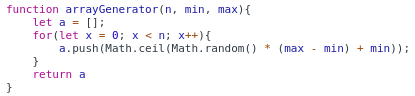
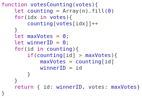

<div align="center">
<table>
    <theader>
        <tr>
            <td></td>
            <th>
                <span style="font-weight:bold;">UNIVERSIDAD NACIONAL DE SAN AGUSTIN</span><br />
                <span style="font-weight:bold;">FACULTAD DE INGENIERÍA DE PRODUCCIÓN Y SERVICIOS</span><br />
                <span style="font-weight:bold;">DEPARTAMENTO ACADÉMICO DE INGENIERÍA DE SISTEMAS E INFORMÁTICA</span><br />
                <span style="font-weight:bold;">ESCUELA PROFESIONAL DE INGENIERÍA DE SISTEMAS</span>
            </th>
            <td></td>
        </tr>
    </theader>
    <tbody>
        <tr><td colspan="3"><span style="font-weight:bold;">Formato</span>: Guía de Práctica de Laboratorio</td></tr>
        <tr><td><span style="font-weight:bold;">Aprobación</span>:  2022/03/01</td><td><span style="font-weight:bold;">Código</span>: GUIA-PRLD-001</td><td><span style="font-weight:bold;">Página</span>: 1</td></tr>
    </tbody>
</table>
</div>

<div align="center">
<span style="font-weight:bold;">GUÍA DE LABORATORIO</span><br />
</div>


<table>
<theader>
<tr><th colspan="6">INFORMACIÓN BÁSICA</th></tr>
</theader>
<tbody>
<tr><td>ASIGNATURA:</td><td colspan="5">Programación Web 2</td></tr>
<tr><td>TÍTULO DE LA PRÁCTICA:</td><td colspan="5">JavaScript</td></tr>
<tr>
<td>NÚMERO DE PRÁCTICA:</td><td>02</td><td>AÑO LECTIVO:</td><td>2022 A</td><td>NRO. SEMESTRE:</td><td>III</td>
</tr>
<tr>
<td>FECHA INICIO::</td><td>02-May-2022</td><td>FECHA FIN:</td><td>06-May-2022</td><td>DURACIÓN:</td><td>04 horas</td>
</tr>
<tr><td colspan="6">RECURSOS:
    <ul>
        <li><a href="https://www.w3schools.com/js">https://www.w3schools.com/js</a></li>        
    </ul>
</td>
</<tr>
<tr><td colspan="6">DOCENTES:
<ul>
<li>Richart Smith Escobedo Quispe - rescobedoq@unsa.edu.pe</li>
</ul>
</td>
</<tr>
</tdbody>
</table>

# JavaScript

[![License][license]][license-file]
[![Downloads][downloads]][releases]
[![Last Commit][last-commit]][releases]

[![Debian][Debian]][debian-site]
[![Git][Git]][git-site]
[![GitHub][GitHub]][github-site]
[![Vim][Vim]][vim-site]
[![Java][Java]][java-site]

#

## OBJETIVOS TEMAS Y COMPETENCIAS

### OBJETIVOS

- Desarrollar habilidades básicas de programación usando JavaScript

### TEMAS
- JavaScript sintaxis básica, programación funcional.

<details>
<summary>COMPETENCIAS</summary>

- C.c Diseña responsablemente sistemas, componentes o procesos para satisfacer necesidades dentro de restricciones realistas: económicas, medio ambientales, sociales, políticas, éticas, de salud, de seguridad, manufacturación y sostenibilidad.
- C.m Construye responsablemente soluciones siguiendo un proceso adecuado llevando a cabo las pruebas ajustada a los recursos disponibles del cliente.
- C.p Aplica de forma flexible técnicas, métodos, principios, normas, estándares y herramientas de ingeniería necesarias para la construcción de software e implementación de sistemas de información.

</details>

## CONTENIDO DE LA GUÍA

### MARCO CONCEPTUAL

- https://www.w3schools.com/js


## EJERCICIO RESUELTO POR EL DOCENTE
- Escriba la función arrayGenerator que reciba tres enteros positivos: n, min y max, con min < max y devuelva un arreglo de n números enteros positivos entre los valores dados (incluyendo min, pero no max). Para la generación de números aleatorios use Math.random() - https://developer.mozilla.org/en-US/docs/Web/JavaScript/Reference/Global_Objects/Math/random.

    - 

- Escriba la función voteCounting; que reciba un arreglo votes, conteniendo los votos para varios candidatos considerando un número para cada candidato, y devuelva un objeto con el número que identifica al candidato ganador y los votos que este obtuvo.

     - 

- Explicación del arreglo contador
    ```sh
    v = [2, 2]
    c = [0, 0, 0]
    c[v[0]] ++
    c -> [0, 0, 1]
    c[v[1]] += 1
    c -> [0, 0, 2]
    ```

#

## EJERCICIOS PROPUESTOS
- Ejercicio 01: Escriba una función que reciba el número de día de la fecha actual new Date() - https://www.w3schools.com/jsref/jsref_obj_date.asp  y devuelva el texto del día de la semana correspondientes. Por ejemplo si recibe 0, devolvería “Domingo”.
- Ejercicio 02: Escriba una página web que reciba un texto y al presionar un botón muestre el mismo texto invertido en otra sección (div). Por ejemplo si se escribe “Hola”, se mostraría como “aloH”.
- Ejercicio 03: Escribir una página que muestre cuántos días faltan para el día de Arequipa!
- Ejercicio 04: Escribir un página que reciba el URL de la sesión de google meet de hoy y devuelva el código de la sesión sin guiones separadores
- Ejercicio 05: Escribir una página que permita calcular las suma de todos los valores de una tabla de valores dinámica. La idea es crear una página web con un formulario que te permita decir cuantos valores tendrá la tabla, luego, al enviar el formulario la tabla se debe crear dinámicamente, junto con otro botón de envió para calcular la suma.
- Ejercicio 06: Utilice la herramienta flipgrid - https://info.flipgrid.com/ envie un video en el tema "Presentacion y ejemplo deJavaScript" ponga aquí los enlaces de sus envíos.
#

## CUESTIONARIO
- Pruebe este código de arrayGenerator() en la página https://jslint.com/
- Revisar esta discusión en stackoverflow - https://stackoverflow.com/questions/4852017/how-to-initialize-an-arrays-length-in-javascript
    - ¿Cómo se pueden resolver los warnings?
    - ¿Se puede modificar la solución usando map? ¿Cómo?


#

## REFERENCIAS
- Javascript tutorial. https://www.w3schools.com/javascript/default.asp, 2021. Accesed: 02-09-2021.
- Loiane Groner. Learning JavaScript Data Structures and Algorithms: Write complex and powerful
- Validador HTML - https://validator.w3.org/
- Validador CSS - https://jigsaw.w3.org/css-validator/

#

[license]: https://img.shields.io/github/license/rescobedoq/pw2?label=rescobedoq
[license-file]: https://github.com/rescobedoq/pw2/blob/main/LICENSE

[downloads]: https://img.shields.io/github/downloads/rescobedoq/pw2/total?label=Downloads
[releases]: https://github.com/rescobedoq/pw2/releases/

[last-commit]: https://img.shields.io/github/last-commit/rescobedoq/pw2?label=Last%20Commit

[Debian]: https://img.shields.io/badge/Debian-D70A53?style=for-the-badge&logo=debian&logoColor=white
[debian-site]: https://www.debian.org/index.es.html

[Git]: https://img.shields.io/badge/git-%23F05033.svg?style=for-the-badge&logo=git&logoColor=white
[git-site]: https://git-scm.com/

[GitHub]: https://img.shields.io/badge/github-%23121011.svg?style=for-the-badge&logo=github&logoColor=white
[github-site]: https://github.com/

[Vim]: https://img.shields.io/badge/VIM-%2311AB00.svg?style=for-the-badge&logo=vim&logoColor=white
[vim-site]: https://www.vim.org/

[Java]: https://img.shields.io/badge/java-%23ED8B00.svg?style=for-the-badge&logo=java&logoColor=white
[java-site]: https://docs.oracle.com/javase/tutorial/


[![Debian][Debian]][debian-site]
[![Git][Git]][git-site]
[![GitHub][GitHub]][github-site]
[![Vim][Vim]][vim-site]
[![Java][Java]][java-site]

[![License][license]][license-file]
[![Downloads][downloads]][releases]
[![Last Commit][last-commit]][releases]
